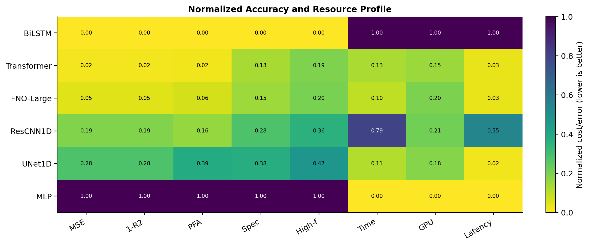
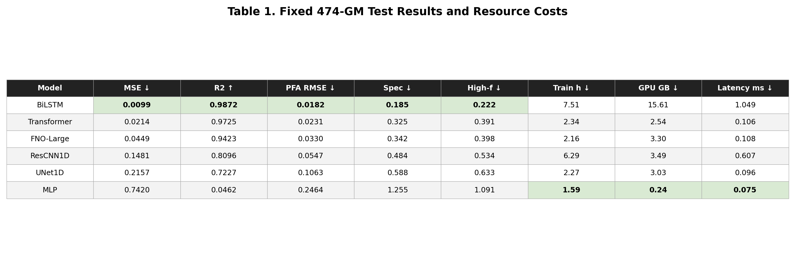

# O1 Baseline Comparison Report

**Protocol.** Full-data O1 comparison on the canonical fixed split: 2,400 train GMs, 600 validation GMs, and 474 held-out test GMs. All models use batch size 64 and 50 epochs. Metrics below are from the fixed 474-GM test set.

## Executive Summary

- BiLSTM achieved the lowest test MSE (0.0099) and highest R2 (0.9872), but required the longest training time (7.51 h) and largest memory footprint (15.61 GB).
- The stabilized pre-norm Transformer ranked second in MSE (0.0214) with substantially lower memory than BiLSTM (2.54 GB).
- FNO-Large was resource efficient but underperformed BiLSTM/Transformer on this O1 fixed 474-GM test split (MSE 0.0449).
- The original Transformer run collapsed to a mean-prediction regime and was excluded after replacing it with a standard pre-norm Transformer and a lower learning rate.

## Main Figures

## Test Results Table

|Model|MSE ↓|R2 ↑|PFA RMSE ↓|Spec ↓|High-f ↓|Train h ↓|GPU GB ↓|Latency ms ↓|
|---|---|---|---|---|---|---|---|---|
|BiLSTM|0.0099|0.9872|0.0182|0.185|0.222|7.51|15.61|1.049|
|Transformer|0.0214|0.9725|0.0231|0.325|0.391|2.34|2.54|0.106|
|FNO-Large|0.0449|0.9423|0.0330|0.342|0.398|2.16|3.30|0.108|
|ResCNN1D|0.1481|0.8096|0.0547|0.484|0.534|6.29|3.49|0.607|
|UNet1D|0.2157|0.7227|0.1063|0.588|0.633|2.27|3.03|0.096|
|MLP|0.7420|0.0462|0.2464|1.255|1.091|1.59|0.24|0.075|

## Interpretation

BiLSTM is the strongest model in raw test accuracy, but this result comes with a clear compute cost: it used roughly 15.6 GB peak memory and 7.5 hours of training. Transformer is a strong second after pre-norm stabilization, with much better memory efficiency. FNO-Large remains competitive and efficient, but it does not dominate this particular full-data fixed-test protocol. This should be reported transparently, with additional OOD/classical-GM analysis used to assess whether FNO has advantages outside the i.i.d. split.

## Artifacts

- Metrics CSV: `../compiled/table4_metrics.csv`
- Training summary: `../compiled/training_runs.csv`
- Plotting summary: `o1_report_summary.csv`
