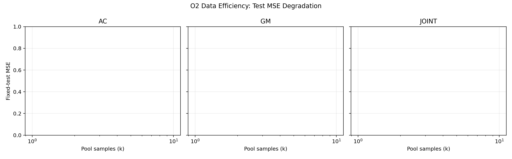
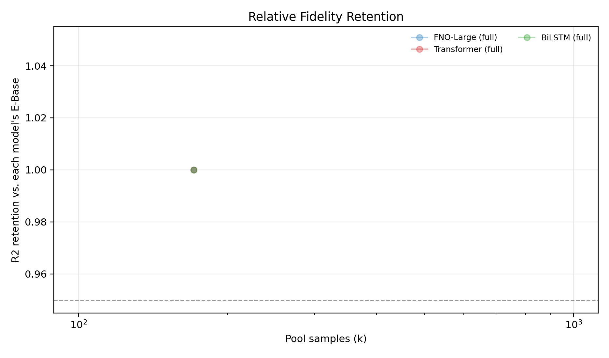
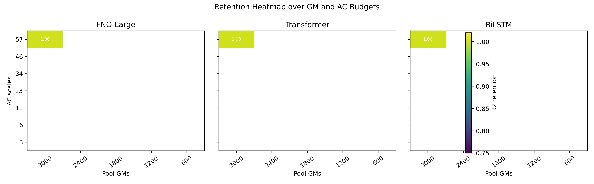
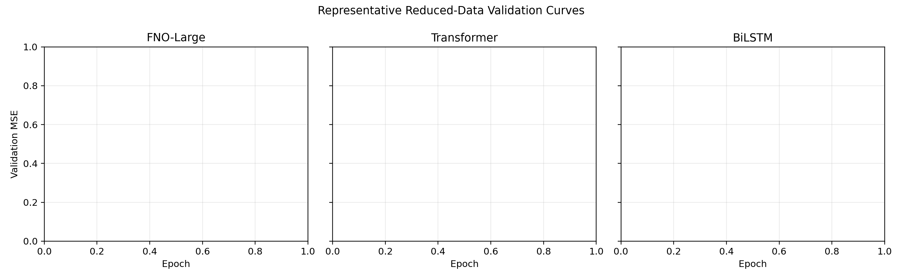
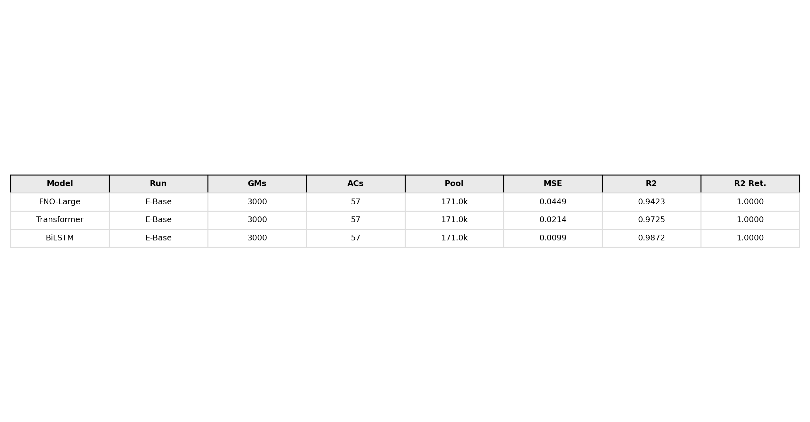

# O2 Data Efficiency Report

Generated: 2026-06-05 12:06:15

## Protocol

The O2 study keeps the fixed 474-GM test set from O1 unchanged and prunes only the supervised train/validation pool. FNO-Large, Transformer, and BiLSTM are trained with the O1-final hyperparameters. E-Base is imported from O1 full-data results.

## Key Conclusions

- FNO-Large: E-Base MSE=0.0449, R2=0.9423; reduced runs pending.
- Transformer: E-Base MSE=0.0214, R2=0.9725; reduced runs pending.
- BiLSTM: E-Base MSE=0.0099, R2=0.9872; reduced runs pending.

## Figures

## Quantitative Table

|Model|Run|Axis|GMs|ACs|Pool|MSE|R2|PFA RMSE|R2 Ret.|Time(h)|GPU(GB)|
|---|---|---|---|---|---|---|---|---|---|---|---|
|FNO-Large|E-Base|full|3000|57|171.0k|0.0449|0.9423|0.0330|1.0000|2.16|3.30|
|Transformer|E-Base|full|3000|57|171.0k|0.0214|0.9725|0.0231|1.0000|2.34|2.54|
|BiLSTM|E-Base|full|3000|57|171.0k|0.0099|0.9872|0.0182|1.0000|7.51|15.61|
