# O1 Baseline 与 O3 OOD 实验总结

生成日期：2026-06-09  
范围：O1 baseline comparison 与 O3 generalization / OOD experiments  

本文件汇总目前已经完成的 O1 与 O3 实验结果，方便后续写论文、补图和整理汇报。核心结论先放在最前面：在标准 50Hz in-distribution test set 上，BiLSTM 和 Transformer 的数值精度明显强于 FNO-Large；但是在 sampling / resolution OOD 场景中，FNO-Large 的优势非常清楚，尤其是用 20Hz 或 25Hz 训练后直接在 50Hz test set 推理时，Transformer 与 BiLSTM 都发生明显退化，而 FNO-Large 仍保持较高 R2。

## 1. Executive Summary

### 1.1 当前最重要的观察

| 维度 | 主要结论 |
|---|---|
| O1 fixed 50Hz baseline | BiLSTM 最优，Transformer 第二，FNO-Large 第三。FNO 在常规固定采样率任务上没有赢。 |
| 训练成本 | BiLSTM 精度最高但训练时间与显存消耗最大；Transformer 精度/资源折中最好；FNO-Large 训练较快、显存较低，但 O1 精度落后。 |
| Classical GM native-resolution OOD | 对 Kobe 100Hz 与 Michoacan 200Hz，FNO-Large 明显强于 BiLSTM/Transformer。 |
| PGA extrapolation OOD | BiLSTM 仍最优，Transformer 第二，FNO-Large 第三。PGA OOD 不是 FNO 的优势场景。 |
| Sampling / resolution OOD | FNO-Large 是唯一稳定模型。20Hz/25Hz 训练后 50Hz 推理，FNO-Large 仍有 R2 0.93+；BiLSTM 与 Transformer 退化到负 R2。 |
| 论文叙事风险 | 如果只看 O1 和 PGA OOD，FNO 没有优势；必须把重点转向 operator 的分辨率泛化能力，而不是单纯 fixed-resolution accuracy。 |

### 1.2 建议论文表述方向

FNO-Large 不应该被包装成“所有场景下精度最高”的模型。更稳妥、也更有理论支撑的表述是：

> FNO-Large sacrifices some fixed-grid in-distribution accuracy, but exhibits much stronger resolution-transfer robustness when the supervision grid is sparse or the input sampling rate changes. This behavior is consistent with the operator-learning perspective: the learned mapping is less tied to a fixed discrete sequence length than recurrent or patch-based sequence models.

中文对应叙事：

> FNO-Large 在标准固定 50Hz 测试集上的点对点误差并不是最低，但当训练监督分辨率降低、测试仍要求恢复 50Hz 动力响应时，它比 BiLSTM 和 Transformer 稳定得多。这说明 FNO 的优势更接近“采样分辨率变化下的算子泛化”，而不是普通 ID 数据上的极限拟合能力。

---

## 2. O1 Baseline Comparison

### 2.1 实验设置

- 数据：3000 个训练 GM，474 个固定 test GM，57 个 AC/PGA scale 组合。
- 输入/输出：统一 50Hz，60s，对应 3000 点序列。
- 目标：比较 MLP、ResCNN1D、UNet1D、FNO-Large、Transformer、BiLSTM 在固定分辨率任务上的 test accuracy、训练成本、推理成本与资源占用。
- 主要结果文件：
  - `../../O1-baseline-comparison/results/report/o1_report_summary.csv`
  - `../../O1-baseline-comparison/results/report/O1_baseline_report.pdf`

### 2.2 Test Accuracy 与资源汇总

| Model | Test MSE | RMSE | MAE | R2 | PFA R2 | Train Time (h) | Peak GPU (GB) | Params (M) |
|---|---:|---:|---:|---:|---:|---:|---:|---:|
| BiLSTM | 0.0099 | 0.0996 | 0.0432 | 0.9872 | 0.9876 | 7.51 | 15.61 | 8.41 |
| Transformer | 0.0214 | 0.1463 | 0.0660 | 0.9725 | 0.9799 | 2.34 | 2.54 | 7.96 |
| FNO-Large | 0.0449 | 0.2119 | 0.1050 | 0.9423 | 0.9590 | 2.16 | 3.30 | 8.51 |
| ResCNN1D | 0.1481 | 0.3848 | 0.2180 | 0.8096 | 0.8874 | 6.29 | 3.49 | 7.36 |
| UNet1D | 0.2157 | 0.4645 | 0.2717 | 0.7227 | 0.5740 | 2.27 | 3.03 | 7.85 |
| MLP | 0.7420 | 0.8614 | 0.5303 | 0.0462 | -1.2870 | 1.59 | 0.24 | 9.44 |

### 2.3 O1 主要图

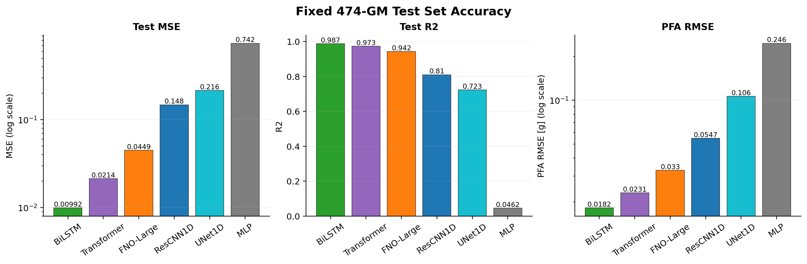

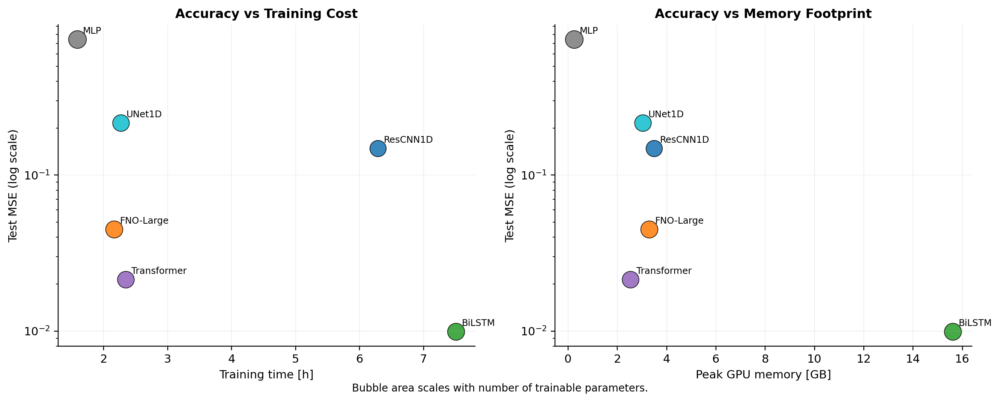

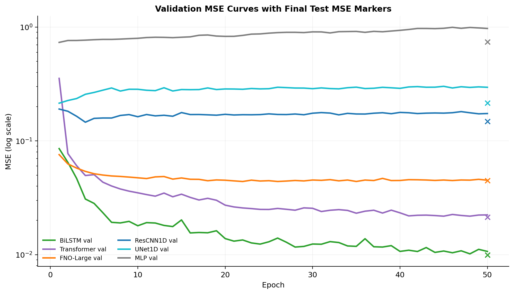

### 2.4 O1 解读

1. **BiLSTM 是 fixed 50Hz test set 上的精度冠军。** Test MSE 为 0.0099，R2 为 0.9872。但训练时间约 7.5h，peak GPU 约 15.6GB，推理延迟也最高。
2. **Transformer 是最强折中模型。** MSE 0.0214，R2 0.9725，训练时间约 2.34h，显存约 2.54GB，推理很快。若审稿人只看固定分辨率任务，Transformer 很有竞争力。
3. **FNO-Large 在 O1 上不占优势。** MSE 0.0449，R2 0.9423，明显弱于 BiLSTM 和 Transformer。但它训练成本与显存较低，这为后续 OOD 分辨率泛化留下空间。
4. **MLP、UNet1D、ResCNN1D 不进入下一轮主线。** 它们在精度或资源效率上都不构成主要竞争者。

---

## 3. O3-A: GM Descriptor / Frequency OOD Analysis

### 3.1 实验目的

在做 classical GM 泛化前，先判断 4 个 classical GMs 相对于训练 3000 GMs 与固定 474 test GMs 是否属于 OOD。为避免 AC scale 造成重复和混淆，采用 amplitude-normalized descriptors，并对 GM 本体进行 response spectrum 与频谱统计分析。

### 3.2 方法摘要

- 对 3000 train GMs、474 test GMs 与 4 个 classical GMs 计算频谱和反应谱描述符。
- Response spectrum 计算使用 C++ 程序，方法为 Nigam-Jennings。
- 对 amplitude-normalized descriptors 做 PCA 与 nearest-neighbor OOD score。
- 主要结果文件：
  - `../results/gm_ood/analysis_scale09_normalized/classical_gm_ood_scores.csv`
  - `../results/gm_ood/analysis_scale09_normalized/figures/gm_ood_pca.png`
  - `../results/gm_ood/analysis_scale09_normalized/figures/psa_overlay.png`

### 3.3 Classical GM OOD Score

| Classical GM | Native Hz | Duration (s) | Dominant Freq (Hz) | Spectral Centroid (Hz) | Train NN Percentile |
|---|---:|---:|---:|---:|---:|
| El Centro (1940) | 50 | 60 | 1.47 | 6.64 | 34.8% |
| San Fernando (1971) | 50 | 60 | 0.97 | 6.20 | 39.8% |
| Michoacan (1985) | 200 | 60 | 1.78 | 7.74 | 82.7% |
| Kobe (1991) | 100 | 60 | 0.75 | 5.62 | 62.8% |

### 3.4 OOD Descriptor Figures

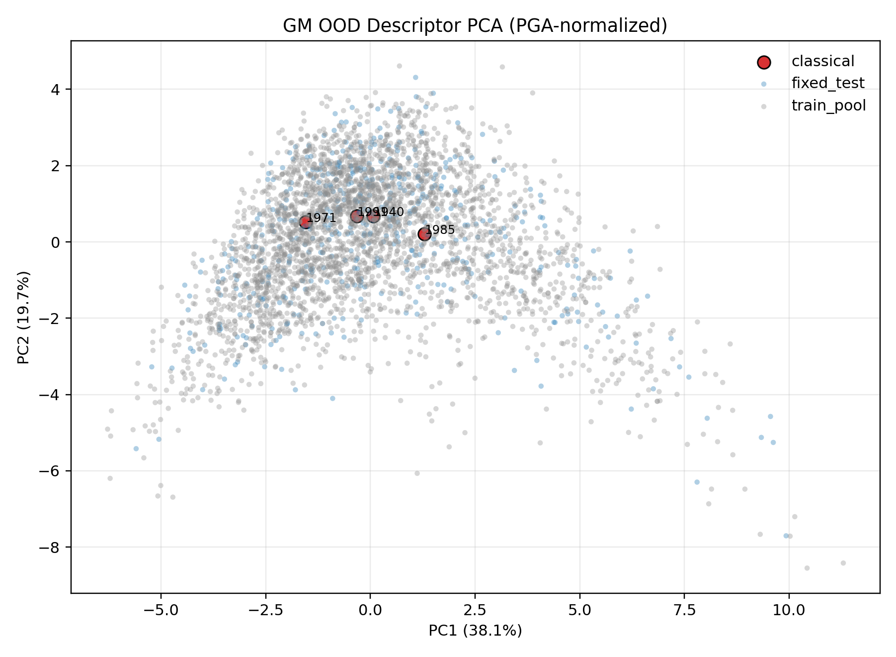

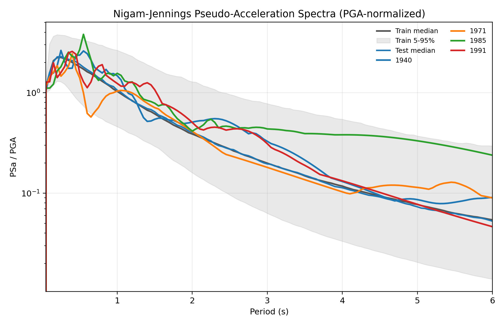

### 3.5 解读

El Centro 与 San Fernando 在 amplitude-normalized descriptor space 中并不是强 OOD，更像是训练分布附近的 classical examples。Michoacan 与 Kobe 更偏 OOD，尤其 Michoacan 的 nearest-neighbor percentile 到 82.7%。这意味着 classical GM 部分不能简单写成“四个都是强 OOD”；更准确的说法是：

> Classical records provide a mixed generalization benchmark: El Centro and San Fernando are relatively close to the training distribution after amplitude normalization, whereas Kobe and Michoacan introduce more pronounced spectral and sampling-resolution shifts.

---

## 4. O3-B: Classical GM Inference

### 4.1 实验设置

本部分使用 O1 full-data checkpoints，对 4 个 classical GMs 做推理。最近一次结果采用 **native Hz input 与 native-length output**：

- El Centro：50Hz input，50Hz output。
- San Fernando：50Hz input，50Hz output。
- Michoacan：200Hz input，200Hz native-length output。
- Kobe：100Hz input，100Hz native-length output。

注意：当前已有的 `Blg1_*_RoofAcc.txt` roof response GT 文件均为 50Hz / 3000 点。因此 Kobe 与 Michoacan 的 native-output 图中，模型输出是 native Hz，黑色 GT 是把已有 50Hz GT 插值到 native 时间轴上用于可视化和指标计算；它不是原生 100Hz/200Hz roof-response GT。

主要结果文件：

- `../results/classical_gms_native_output_o1_full/classical_native_output_metrics.csv`
- `../results/classical_gms_native_output_o1_full/*_native_output.png`

### 4.2 Native-Output Metrics

| Event | Native Hz | Model | MSE | RMSE | MAE | R2 |
|---|---:|---|---:|---:|---:|---:|
| El Centro | 50 | BiLSTM | 0.0221 | 0.1487 | 0.0761 | 0.9509 |
| El Centro | 50 | Transformer | 0.0216 | 0.1468 | 0.0797 | 0.9521 |
| El Centro | 50 | FNO-Large | 0.0287 | 0.1695 | 0.1069 | 0.9361 |
| San Fernando | 50 | BiLSTM | 0.0242 | 0.1556 | 0.0514 | 0.9137 |
| San Fernando | 50 | Transformer | 0.0448 | 0.2118 | 0.0611 | 0.8401 |
| San Fernando | 50 | FNO-Large | 0.0782 | 0.2797 | 0.0969 | 0.7210 |
| Michoacan | 200 | BiLSTM | 0.3471 | 0.5892 | 0.4139 | -0.7190 |
| Michoacan | 200 | Transformer | 0.1889 | 0.4346 | 0.2670 | 0.0646 |
| Michoacan | 200 | FNO-Large | 0.0372 | 0.1928 | 0.1383 | 0.8160 |
| Kobe | 100 | BiLSTM | 0.5273 | 0.7262 | 0.2938 | -1.2551 |
| Kobe | 100 | Transformer | 0.1930 | 0.4393 | 0.1639 | 0.1748 |
| Kobe | 100 | FNO-Large | 0.0197 | 0.1402 | 0.0785 | 0.9159 |

### 4.3 Native-Output Figures

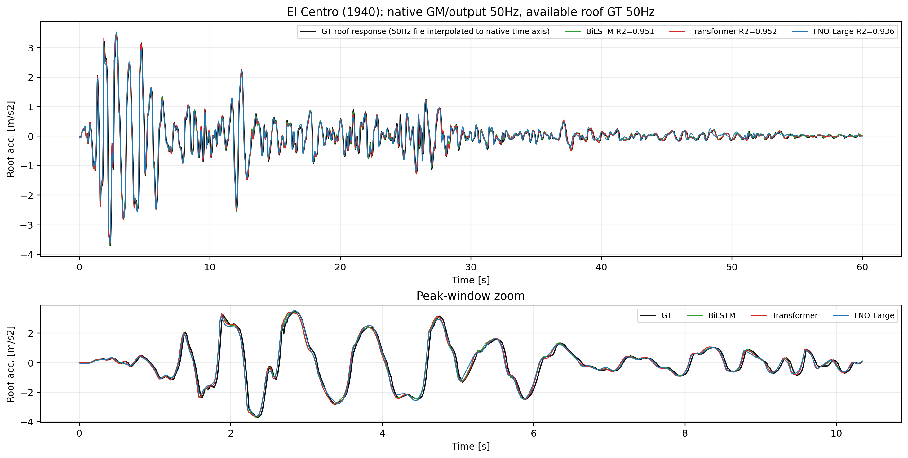

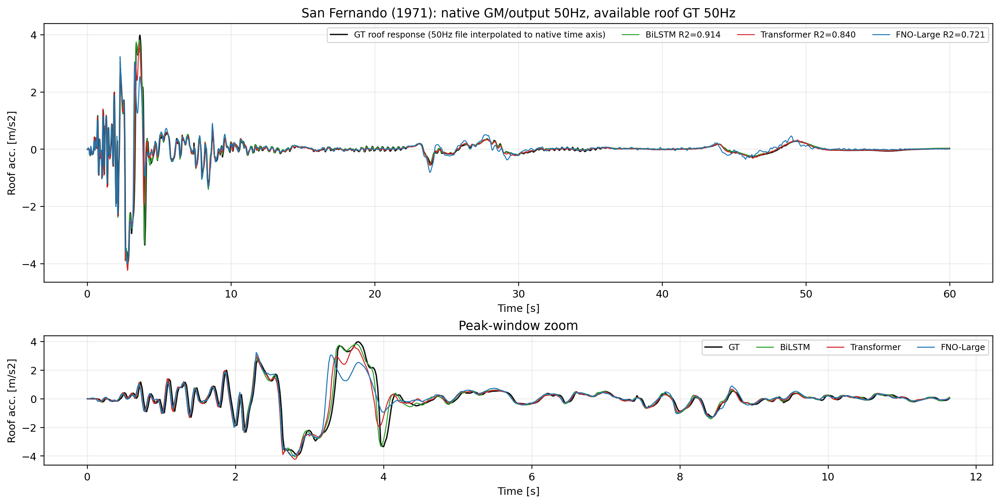

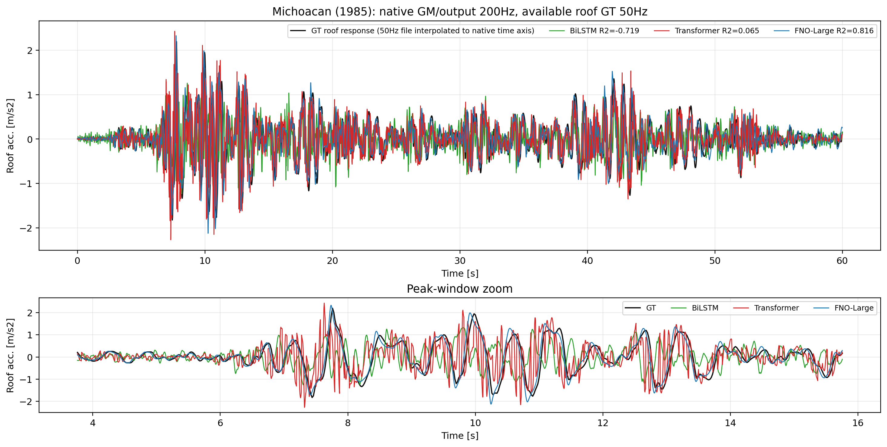

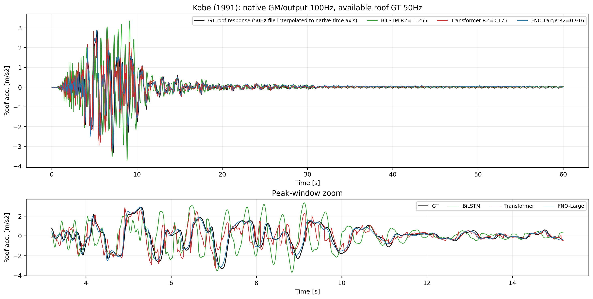

### 4.4 解读

这部分是 FNO 叙事中比较有用的证据。50Hz classical examples 上，BiLSTM/Transformer 仍然很强，FNO 没有统治性优势；但在 100Hz/200Hz native-resolution cases 上，FNO-Large 明显更稳定。BiLSTM 虽然理论上可以变长推理，但在 Kobe/Michoacan 上退化严重；Transformer 通过 position embedding interpolation 处理变长输入，但效果也明显下降。FNO 的 FFT/operator 结构在这里更接近它应有的优势场景。

---

## 5. O3-C: PGA Extrapolation OOD

### 5.1 实验设置

- 训练集：3000 GMs，但只使用约 1--10 m/s2 的 AC/PGA scale subset。
- 测试集：固定 474 test GMs × 57 scales，仍然覆盖完整 PGA scale range。
- 模型：BiLSTM、Transformer、FNO-Large 各跑一次。
- 目标：测试 amplitude/PGA scale 外推能力。
- 主要图表：
  - `../results/figures_o3_review/pga_ood_by_scale_mse_r2.png`
  - `../results/figures_o3_review/pga_ood_test_examples_time_histories.png`
  - `../results/figures_o3_review/pga_ood_overall_cost_summary.png`

### 5.2 Overall Results

| Model | Test MSE | RMSE | MAE | R2 | PFA R2 | Train Time (h) | Peak GPU (GB) |
|---|---:|---:|---:|---:|---:|---:|---:|
| BiLSTM | 0.0148 | 0.1215 | 0.0484 | 0.9810 | 0.9758 | 4.89 | 15.61 |
| Transformer | 0.0319 | 0.1786 | 0.0771 | 0.9590 | 0.9557 | 2.04 | 2.54 |
| FNO-Large | 0.0669 | 0.2587 | 0.1264 | 0.9140 | 0.9388 | 2.02 | 3.30 |

### 5.3 PGA OOD Figures

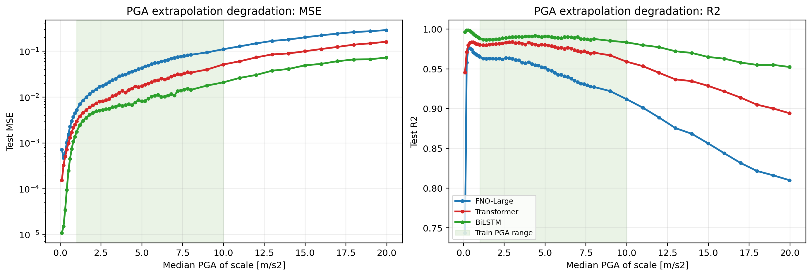

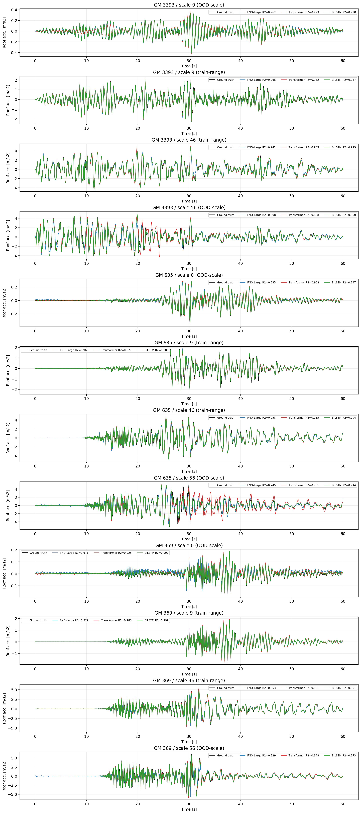

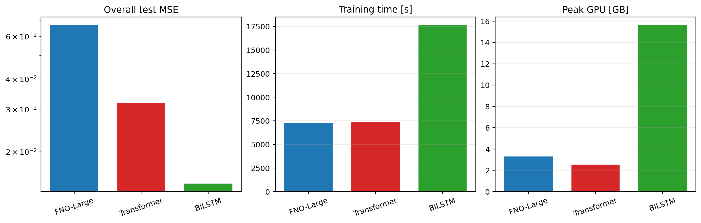

### 5.4 解读

PGA OOD 并没有体现 FNO 的优势。BiLSTM 仍然最强，Transformer 第二，FNO-Large 第三。这说明 amplitude extrapolation 更像是非线性尺度外推问题，而不是采样分辨率/连续算子泛化问题。论文中不建议把 PGA OOD 作为 FNO 的主要卖点，只能作为一个 negative or mixed OOD benchmark。

---

## 6. O3-D: Sampling / Resolution OOD

### 6.1 实验设置

这是目前最关键的 O3 实验。

- S-20Hz：训练/验证输入与输出均下采样到 20Hz / 1200 点；测试仍使用 50Hz / 3000 点。
- S-25Hz：训练/验证输入与输出均下采样到 25Hz / 1500 点；测试仍使用 50Hz / 3000 点。
- S-50Hz：标准 full-resolution baseline，训练/验证/测试均为 50Hz / 3000 点。
- 测试集：固定 474 test GMs × 57 scales。
- 输出：测试阶段三个模型均输出 50Hz / 3000 点，不对 test output 做后处理插值。

模型处理方式：

- FNO-Large：直接接受不同长度序列，FFT operator 自然适配 1200/1500/3000 点。
- BiLSTM：递归结构可以变长输入/输出，但 resolution transfer 表现很差。
- Transformer：训练长度对应不同 patch 数；50Hz 测试时通过 linear interpolation 扩展 positional embedding。

主要结果文件：

- `../results/sampling_ood/figures/sampling_ood_overall_summary.csv`
- `../results/sampling_ood/figures/sampling_ood_overall_mse_r2.png`
- `../results/sampling_ood/figures/sampling_ood_test_examples_time_histories.png`

### 6.2 Overall Results

| Model | Train Hz | Test Hz | Test MSE | RMSE | MAE | R2 | Train Time (h) | Peak GPU (GB) |
|---|---:|---:|---:|---:|---:|---:|---:|---:|
| FNO-Large | 20 | 50 | 0.0530 | 0.2303 | 0.1127 | 0.9319 | 2.69 | 1.47 |
| FNO-Large | 25 | 50 | 0.0487 | 0.2207 | 0.1092 | 0.9374 | 3.13 | 1.77 |
| FNO-Large | 50 | 50 | 0.0449 | 0.2119 | 0.1050 | 0.9423 | 3.11 | 3.30 |
| Transformer | 20 | 50 | 1.1857 | 1.0889 | 0.6203 | -0.5242 | 2.74 | 1.12 |
| Transformer | 25 | 50 | 1.0491 | 1.0243 | 0.5733 | -0.3486 | 3.23 | 1.37 |
| Transformer | 50 | 50 | 0.0212 | 0.1456 | 0.0659 | 0.9727 | 3.11 | 2.54 |
| BiLSTM | 20 | 50 | 1.0790 | 1.0387 | 0.6007 | -0.3870 | 4.79 | 6.38 |
| BiLSTM | 25 | 50 | 0.9699 | 0.9848 | 0.5652 | -0.2468 | 5.46 | 7.92 |
| BiLSTM | 50 | 50 | 0.0099 | 0.0996 | 0.0432 | 0.9872 | 7.18 | 15.61 |

### 6.3 Sampling OOD Figures

### 6.4 解读

这是目前最强的 FNO 证据。BiLSTM 和 Transformer 在 50Hz ID 训练下非常强，但一旦训练监督降到 20Hz 或 25Hz、测试仍要求 50Hz 输出，它们几乎完全失效，R2 变成负数。FNO-Large 在相同条件下只发生温和退化：

- FNO-Large 50Hz baseline：R2 0.9423。
- FNO-Large 25Hz train -> 50Hz test：R2 0.9374。
- FNO-Large 20Hz train -> 50Hz test：R2 0.9319。

这说明 FNO 的核心优势不是 fixed-grid fitting，而是对采样分辨率变化的鲁棒性。这个结果可以成为 O3 的主线，也可以反过来解释为什么 O1 中 FNO 不如 BiLSTM/Transformer：固定 50Hz 条件下，序列模型可以充分利用离散网格和数据量进行强拟合；但一旦训练和测试采样率不一致，序列模型对离散 token/grid 的依赖暴露出来。

---

## 7. 综合结论

### 7.1 对三个主模型的定位

| Model | 最适合的表述 | 风险 |
|---|---|---|
| BiLSTM | fixed-resolution accuracy champion | 训练慢、显存高、native-resolution / sampling OOD 退化严重 |
| Transformer | strong fixed-grid baseline with best accuracy-cost tradeoff | position embedding 依赖固定长度，低分辨率训练到高分辨率测试时退化明显 |
| FNO-Large | resolution-transfer robust operator baseline | ID 精度与 PGA OOD 不如 BiLSTM/Transformer，需要明确限定优势场景 |

### 7.2 可以写进论文的主张

1. **Fixed-resolution accuracy is not enough.** O1 说明 BiLSTM/Transformer 在标准 50Hz benchmark 上可以非常强，FNO 不应只靠 ID MSE 证明优势。
2. **PGA extrapolation is a mixed OOD benchmark.** PGA OOD 中 FNO 不占优，因此不能把所有 OOD 都归因于 operator generalization。
3. **Resolution-transfer is the key evidence.** Sampling OOD 与 native classical GM 共同说明，FNO-Large 对采样率变化更稳。
4. **FNO 的优势应被定义为 discretization robustness。** 这比“泛化性更好”更精确，也更容易防守。

### 7.3 当前最适合的论文图表组合

建议 O3 至少包含：

| Figure/Table | 内容 | 作用 |
|---|---|---|
| Table O1 | Fixed 50Hz baseline test MSE/R2/time/GPU | 证明 baseline 公平，承认 Transformer/BiLSTM 很强 |
| Figure O1 tradeoff | Accuracy-resource bubble plot | 显示 Transformer 是强 baseline，FNO 不是靠资源堆出来 |
| Figure GM descriptor PCA | 4 classical GMs 与 train/test descriptor space | 说明 GM OOD 的程度 |
| Table Classical native-output | 4 classical GMs 的 native-resolution metrics | 展示 Kobe/Michoacan 上 FNO 的 native-resolution 稳定性 |
| Figure Sampling OOD | Train Hz vs Test 50Hz MSE/R2 | 主图，突出 FNO 的 resolution-transfer robustness |
| Figure Sampling examples | 典型 test time histories | 直观看出序列模型在低分辨率训练下崩溃 |
| Supplemental PGA OOD | PGA by-scale curves | 作为完整 OOD 检验，但不作为主卖点 |

---

## 8. Open Caveats

1. **Classical GM 的 roof response GT 仍是 50Hz。** Kobe/Michoacan 的 native-output 对比目前使用 50Hz GT 插值到 native 时间轴。若后续有真正 100Hz/200Hz roof response GT，可以重跑 native metrics。
2. **FNO frequency bandwidth 可能仍不足。** 当前 FNO-Large 的 `n_modes=512` 对 3000 点 50Hz 信号只覆盖部分频谱。后续可以做 `n_modes=1024/1500` 或 multi-resolution FNO 的 ablation。
3. **PGA OOD 对 FNO 不友好。** 这不是坏事，但论文表述需要诚实：FNO 的优势不是所有 OOD，而是采样/离散化 OOD。
4. **Sampling OOD 是目前最强结论。** 后续 report 和 manuscript 应围绕这一点组织，而不是硬说 FNO 在 O1 中全面优于 Transformer/BiLSTM。

---

## 9. Result Index

### O1

- O1 PDF report: `../../O1-baseline-comparison/results/report/O1_baseline_report.pdf`
- O1 summary CSV: `../../O1-baseline-comparison/results/report/o1_report_summary.csv`
- O1 figures: `../../O1-baseline-comparison/results/report/figures/`

### O3

- O3 status/TODO: `00_status_todo.md`
- GM OOD normalized analysis: `../results/gm_ood/analysis_scale09_normalized/`
- Classical GM native-output: `../results/classical_gms_native_output_o1_full/`
- PGA OOD: `../results/pga_ood/runs/` and `../results/figures_o3_review/`
- Sampling OOD: `../results/sampling_ood/`

